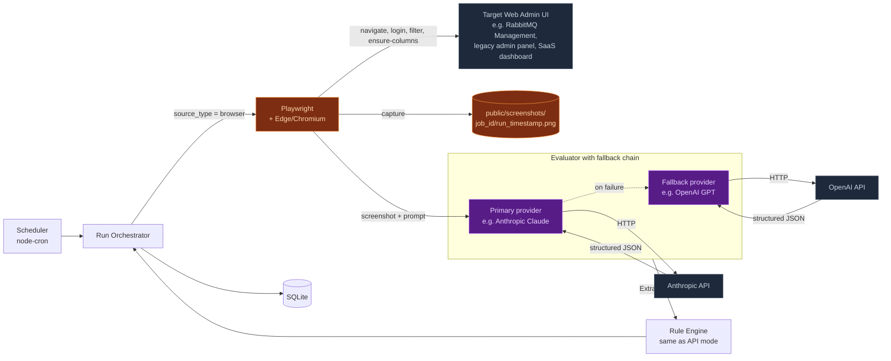

<div align="center">

# Argus AI — Vision Mode

**Monitoring for systems that only have a web UI.**

*Sub-document of the main [Argus AI README](./README.md). Read that first.*

</div>

---

## Table of Contents

1. [Why Vision mode exists](#why-vision-mode-exists)
2. [When to use Vision mode vs RabbitMQ API direct](#when-to-use-vision-mode-vs-rabbitmq-api-direct)
3. [How it works step by step](#how-it-works-step-by-step)
4. [Vision-mode architecture diagram](#vision-mode-architecture-diagram)
5. [Configuration](#configuration)
6. [Provider chain and automatic fallback](#provider-chain-and-automatic-fallback)
7. [Cost considerations](#cost-considerations)
8. [Limitations and gotchas](#limitations-and-gotchas)
9. [Migrating a workflow between Vision and API modes](#migrating-a-workflow-between-vision-and-api-modes)

---

## Why Vision mode exists

Not every system that needs monitoring has a clean API. Some examples Argus has encountered:

- A 15-year-old internal admin panel built on ASP.NET WebForms with no JSON endpoints.
- A SaaS dashboard whose vendor charges extra for API access but permits browser login for free.
- A queue management tool where the API exists but is locked behind an enterprise tier.
- A custom Grafana-like UI built in-house that no one wrote API docs for.

**Vision mode lets Argus monitor any of these.** It logs into the web UI the same way a human would, takes a screenshot, and asks an AI to read the screenshot and extract the data — the same data shape the rule engine consumes for any other source.

If it is visible in a browser, Argus can read it.

The trade-off is that Vision is slower and costs a small fraction of a cent per check (an AI inference call). For systems that do have an API — like RabbitMQ — the team should use the **API-direct mode** described in the main README. Vision is the universal fallback when nothing else works.

---

## When to use Vision mode vs RabbitMQ API direct

| Question | API direct (`rabbitmq_api`) | Vision (`browser`) |
|---|---|---|
| Does the target system expose a documented JSON API? | Required | Not needed |
| Are HTTP credentials enough? | Yes — Basic Auth | Depends on what the UI accepts |
| Speed per check | ~10–100 ms | ~10–30 seconds |
| Cost per check | Free | ~$0.001–$0.01 (AI inference) |
| Brittle to UI redesigns? | No | Mildly — AI is robust but not magical |
| Works against systems with no API? | No | Yes |
| Recommended for RabbitMQ? | Yes — use this | Only as fallback |

**Rule of thumb:** if the target has a stable structured API, use API-direct. Reserve Vision for "I'd love to monitor this but the only way in is a login page."

---

## How it works step by step

When a workflow with `source_type: 'browser'` fires:

1. **Launch browser.** Playwright spins up Microsoft Edge (or Chromium if Edge isn't installed). `BROWSER_MODE=headed` shows the browser window during the run — useful for demos and debugging. `BROWSER_MODE=headless` runs invisibly.
2. **Navigate to the URL.** From the workflow definition (`job.url + steps.page_path`).
3. **Log in.** Argus types the username/password into whatever input fields it can find (multi-selector fallback chain).
4. **Apply filters.** Type a filter string into the page's search/filter box (e.g. `"blueyonder"`) so only the relevant queues remain visible.
5. **Ensure columns.** Click `+`/`-` toggles in column-picker UIs to make sure the metrics you care about (e.g. "Consumer count") are visible.
6. **Take a screenshot.** Saved to `public/screenshots/job_{id}/run_{timestamp}.png`. Kept forever as an audit trail.
7. **Send the screenshot to an AI vision model.** Either Anthropic Claude or OpenAI GPT, depending on the provider chain you configured.
8. **AI returns structured JSON.** The model is prompted to extract a normalized shape:
   ```json
   {
     "page_loaded_correctly": true,
     "filter_text_visible": "blueyonder",
     "row_count": 6,
     "queues": [
       { "name": "blueyonder.orders", "consumer_count": 2,
         "ready_messages": 1, "unacked_messages": 2,
         "type": "classic", "state": "running" }
     ]
   }
   ```
9. **Feed into the same rule engine.** From this point the flow is *identical* to API-direct mode. Same rules, same wait-and-confirm, same notifier, same dashboard.
10. **Record cost.** Each run stores `ai_cost_cents` so you can see at a glance what each check costs.

---

## Vision-mode architecture diagram



The screenshot is kept on disk as part of the audit trail. If you ever need to ask "what did the queue admin UI look like at 14:00 on Tuesday when the alert fired?" — you have the exact pixel-perfect evidence.

---

## Configuration

Vision mode needs at least one AI provider key set in `.env`:

```ini
# Anthropic (Claude) — primary by default
ANTHROPIC_API_KEY=sk-ant-…
ANTHROPIC_MODEL=claude-opus-4-5

# OpenAI (GPT) — fallback by default
OPENAI_API_KEY=sk-…
OPENAI_MODEL=gpt-4o

# Provider chain
AI_PROVIDER_PRIMARY=anthropic
AI_PROVIDER_FALLBACK=openai

# Browser setup
BROWSER_MODE=headed              # 'headed' or 'headless'
BROWSER_CHANNEL=msedge           # 'msedge' or 'chromium'
```

You also need Playwright's browser binaries installed:

```bash
npm run playwright:install      # installs Microsoft Edge
# OR if Edge isn't available:
npx playwright install chromium
# and set BROWSER_CHANNEL=chromium in .env
```

To switch an existing workflow to Vision mode, edit the workflow via the Job Builder UI and toggle the source type, or set `source_type: 'browser'` in the workflow record.

---

## Provider chain and automatic fallback

Argus supports running **two AI providers in parallel** with automatic fallback. This is configured per workflow:

| Workflow setting | Behavior |
|---|---|
| **System default** | Tries `AI_PROVIDER_PRIMARY` first. If it throws (network error, 4xx/5xx, malformed JSON), automatically retries with `AI_PROVIDER_FALLBACK`. |
| **Anthropic only** | Uses Claude only. No fallback. |
| **OpenAI only** | Uses GPT only. No fallback. |

The `run` record tracks:

- `ai_provider_used` — which provider actually produced the verdict.
- `ai_model_used` — which model name (`claude-opus-4-5`, `gpt-4o`, etc.).
- `ai_cost_cents` — estimated cost in US cents (computed from input/output token counts).
- `ai_fallback_notes` — a JSON-serialized list of any providers that failed before the successful one, with their error messages.

The run-detail page surfaces all of this clearly. You can audit which provider was used and how much it cost for every single historical run.

---

## Cost considerations

Cost is dominated by the **input image size** (screenshots are large compared to text prompts) and the **output tokens** (the structured JSON the model returns).

Rough estimates per run, as of writing:

| Provider + Model | Approximate cost per run |
|---|---|
| Anthropic Claude (Opus) | ~$0.01–$0.02 |
| Anthropic Claude (Sonnet) | ~$0.002–$0.005 |
| OpenAI GPT-4o | ~$0.003–$0.008 |

Even at the upper bound, **a workflow running 10 times a day costs $0.10–$0.20 per day per workflow**. For five workflows running on a typical business-hours schedule, you're looking at **~$15–$30/month in AI costs.**

For comparison, the same workflow in **API-direct mode costs $0/month** — which is why we default to it for RabbitMQ.

The per-run cost is visible on the dashboard ("Last cost: 0.8¢") and on each run-detail page. There is no surprise.

---

## Limitations and gotchas

| Issue | Detail |
|---|---|
| **Selector fragility** | Browser-mode automation uses multi-selector fallbacks for login/filter/columns, but if a UI ships a substantial redesign, the run may fail. AI-vision extraction is more robust than the navigation step. |
| **Anti-bot defenses** | If the target UI uses Cloudflare bot protection, CAPTCHAs, or Cloudflare Turnstile, Playwright will be blocked. Argus has no current evasion strategy by design (we don't want to encourage that). |
| **Slow runs** | A vision run takes 10–30 seconds. If you have many workflows running at the top of every hour, they'll queue. Stagger schedules with different minute values (e.g. `0 * * * *`, `5 * * * *`, `10 * * * *`). |
| **Screenshot disk usage** | Each screenshot is ~50–200 KB. Argus keeps them forever as an audit trail. Plan ~1–5 MB of disk per workflow per month for hourly schedules. There is no built-in retention policy in v0.2 — clean up manually if needed. |
| **AI returns wrong JSON** | The prompts are strict and the parser is forgiving (skips malformed entries), but if the model genuinely can't understand the page (e.g. an empty error screen), Argus emits a system_error with `page_loaded_correctly=false`. |
| **Cost surprises** | Always check the **Settings page → provider chain** to confirm which keys are set. A misconfigured primary may silently fall over to the more expensive fallback for every run. |

---

## Migrating a workflow between Vision and API modes

Suppose you originally created a workflow in Vision mode but later discover the target has an API. You can switch without losing run history:

1. Open the **Job Builder** for the workflow (`/builder/{id}`).
2. Change the **Source type** dropdown from "Vision (browser)" to "API direct" (if the UI exposes the toggle — otherwise edit the JSON via `/api/jobs/{id}` PUT).
3. Update the **URL** to the API base if it differs (e.g. drop the `/#/queues` hash).
4. Update **credentials** if the API uses different auth.
5. **Save**.

All historical runs remain visible. Future runs use the API path. The rule definitions are mode-agnostic.

This is intentional: rules are defined once, source adapters are pluggable.

---

<div align="center">
<sub>Argus AI · Vision mode reference · See <a href="./README.md">main README</a> for the bigger picture</sub>
</div>
