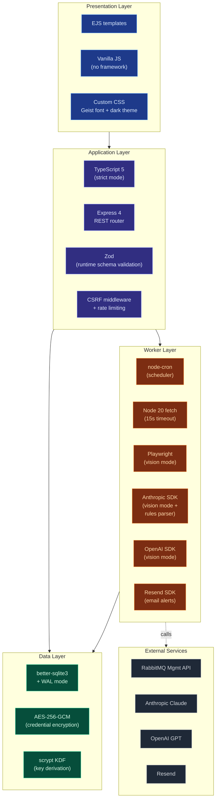
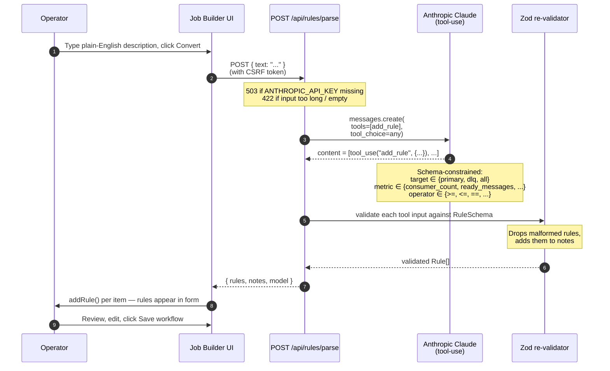

<div align="center">

# Argus AI

**Operations monitoring platform for our message-queue infrastructure.**

</div>

---

## Table of Contents

1. [What is Argus AI?](#what-is-argus-ai)
2. [The problem we solve](#the-problem-we-solve)
3. [How it works in plain English](#how-it-works-in-plain-english)
4. [System architecture](#system-architecture)
5. [Technology stack](#technology-stack)
6. [What happens during one run, step by step](#what-happens-during-one-run-step-by-step)
7. [The dashboard — single pane of glass](#the-dashboard--single-pane-of-glass)
8. [Designed to scale — multiple workflows on one platform](#designed-to-scale--multiple-workflows-on-one-platform)
9. [Health rules and thresholds](#health-rules-and-thresholds)
10. [Plain-English rule writing](#plain-english-rule-writing)
11. [Where AI fits in this platform](#where-ai-fits-in-this-platform)
12. [Self-confirmation — proving the system is alive](#self-confirmation--proving-the-system-is-alive)
13. [Email alerts](#email-alerts)
14. [Quick start](#quick-start)
15. [Configuration reference (.env)](#configuration-reference-env)
16. [Two operating modes: API-direct vs Vision](#two-operating-modes-api-direct-vs-vision)
17. [Security model](#security-model)
18. [Project structure](#project-structure)
19. [Roadmap](#roadmap)

---

## What is Argus AI?

**Argus AI is an internal monitoring platform that watches our business-critical message queues and reports — with measured evidence — whether they are healthy.**

It is designed for one objective: never miss a problem in our operational pipelines, and never let the team assume "everything is fine" when it isn't.

In summary:

- Argus connects to our queue system (currently **RabbitMQ**, via its built-in HTTP Management interface — the same one operators log into in a browser).
- It reads the live state of our queues on a configurable schedule (a *cron expression* — for example, "every hour during business days").
- It checks that state against rules we have defined (e.g. *"every primary queue must have at least one consumer worker active"*, *"no dead-letter queue may hold more than 10 messages"*).
- When every rule passes, the dashboard shows green visual confirmation.
- When a rule fails — or when the monitoring system itself stops firing — Argus sends an HTML alert email with the exact reason, the measured numbers, and a direct link to the run detail page.

It is the difference between *"I think things are running"* and *"I can see, right now, that the last 12 health checks across the last 12 hours all passed, and the actual measured values for every rule were inside the safe range."*

---

## The problem we solve

Most monitoring tools alert the team when something is *already broken*. That is necessary but not sufficient — because **silence is not the same as success**. If our monitor itself dies (a process crashes, a credential expires, a network rule changes), we stop receiving alerts. We assume everything is fine. Then a real incident hits and we only find out from our customers.

Argus solves this with three guarantees:

1. **Visible positive confirmation.** The dashboard shows a strip of the last 20 runs as colored dots. Five green dots in a row is proof the schedule is firing AND producing healthy verdicts — not just absence of alerts.
2. **Observed-value pills.** Next to every rule, the dashboard shows the actual measured number on the most recent run (for example, `observed 1–3` next to a threshold of `≥ 1`). Operators do not just see "healthy" — they see the real numbers.
3. **Stale-run detection.** If the scheduler should have run by now but hasn't, the workflow card turns yellow with a clear warning: *"No run since scheduled time (Xh overdue). Scheduler may have stopped — investigate before trusting the healthy badge."*

The combination of these three means **the absence of an email is itself meaningful**: the dashboard is showing green dots, the observed numbers are in range, and the next-run timer is on schedule. The team has *positive* evidence of health, not just *absence* of failure.

---

## How it works in plain English

Argus behaves like an automated operations engineer who, on a fixed schedule:

1. **Calls our RabbitMQ Management API** using stored credentials (encrypted at rest with AES-256-GCM).
2. **Reads the live state of every queue** that matches a configured name filter (for example, "all queues containing the substring `blueyonder`").
3. **Compares the readings to our defined rules** ("at least 1 consumer", "no more than 50 backed-up messages", "DLQs under 10 messages").
4. **If a rule fails** and the *wait-and-confirm* safety net is enabled, Argus waits a configurable number of minutes and checks again — to avoid alerting on a transient blip.
5. **Records the result** to a local database (every run is auditable indefinitely — JSON data in API mode, screenshots in vision mode).
6. **Sends an email** when a rule fails or the monitoring system itself errors out, with a clear subject line, the failing rule, the observed value, and a clickable link to the run detail page.
7. **Updates the dashboard** so the team can verify health at a glance from any browser.

The "AI" in Argus AI refers to three distinct capabilities:

- A **plain-English rule writer** (Anthropic Claude via tool-use). An operator types *"every primary queue should have at least 1 consumer and DLQs shouldn't exceed 10 ready messages"* into the Job Builder and Argus converts it into structured rules ready to save. See [Plain-English rule writing](#plain-english-rule-writing) below.
- A **vision-AI fallback mode** (using Anthropic Claude or OpenAI GPT) that can read screenshots of any web admin UI, not just RabbitMQ. This is the "anything-monitorable" capability for systems that expose no API. See [README-VISION.md](./README-VISION.md) for details.
- An **intelligent rule engine** that emits structured observed values and supports wait-and-confirm logic, going beyond simple "alert on threshold" tools.

For RabbitMQ specifically, **the scheduled monitoring path uses zero AI calls** — Argus talks to RabbitMQ's HTTP Management API directly, parses the JSON response, runs the rule engine. AI is invoked only in two situations: (1) when an operator is *writing* rules in plain English in the Job Builder (interactive, one-off), or (2) when a workflow is explicitly configured for Vision mode (`source_type: 'browser'`, for systems with no API). The seeded blueYonder workflow uses the direct API path, so our queues are checked many times per day with no per-check AI cost.

---

## System architecture

An **operator** opens the web dashboard, defines what "healthy" means for each queue (the rules), and waits. The **Monitoring Engine** runs on a schedule, asks the queue cluster for live numbers through one of two **Data Source Connectors**, evaluates the numbers against the rules, records the result in the **local database**, and triggers an **email alert** if anything fails. The same dashboard shows live status, history, and observed numbers — no need to log into RabbitMQ itself.

<div align="center">
  <a href="docs/architecture.svg" title="Click to open at full resolution">
    
  </a>
  <br />
  <sub><i>Click the diagram to open at full resolution.</i></sub>
</div>

<br />

### The five blocks, in plain language

1. **Web Dashboard** — what the operator sees in a browser. Shows live status, recent runs, and the rules that define healthy. Built so a non-technical person can review at a glance.
2. **Monitoring Engine** — the scheduled "brain" of the platform. Three sub-components: the Scheduler (decides *when* a check runs), the Health Rule Engine (decides *whether the numbers are OK*), and the Wait-and-Confirm Safety Net (avoids false alarms by re-checking transient failures).
3. **Data Source Connectors** — *how* the platform gets the live numbers. Two options, chosen per workflow:
   - **Option 1 — Direct API.** Calls RabbitMQ's built-in management API over HTTPS. Used for all our current workflows. Fast (~50 ms), free, and the most reliable path.
   - **Option 2 — Universal Adapter (AI Vision).** A strategic fallback. Logs into any web admin UI using a headless browser (Playwright + Microsoft Edge or Chromium) and uses AI (Anthropic Claude or OpenAI GPT) to read the screen. This lets us monitor *anything that has a UI* — including legacy systems, vendor SaaS dashboards, or future products that expose no API. Currently inactive for our RabbitMQ workflows because Option 1 is the better fit, but available immediately when needed.
4. **Audit & Storage** — every run is recorded indefinitely in a local database (SQLite). Operator credentials are encrypted at rest (AES-256-GCM). Run history is queryable forever — useful for postmortems and compliance.
5. **Alert System** — when a rule fails or the monitoring system itself errors out, an HTML email is sent via [Resend](https://resend.com) (a transactional-email service). The email contains the failing rule, the observed numbers, and a one-click link to the run detail page.

### Where AI fits (and where it doesn't)

The monitoring path uses **zero AI calls at runtime**. The platform talks to RabbitMQ directly. Queue checks are deterministic and free, no matter how many times they run per day.

AI (Anthropic Claude) is invoked in **two clearly-bounded, optional places**, both shown in the diagram with dashed or labeled lines:

- **The AI Rule Assistant** — when an operator clicks the *Convert to rules* button after typing rules in plain English. One-off, on demand, never automatic. Approximately one cent per click. If the API key is removed, the manual rule form still works.
- **The Universal Adapter (Option 2)** — would invoke Claude or GPT only if a workflow is configured to use Option 2 instead of Option 1. Currently no workflow uses Option 2, so no AI is invoked at runtime today.

### Talking points for cross-questions

Anticipated leadership questions and concise answers:

- *"Why are we using AI at all?"* — In one optional spot (rule writing) and as a strategic fallback (Option 2 adapter). Day-to-day monitoring uses no AI.
- *"What if Anthropic goes down?"* — Monitoring is unaffected. Only the rule-writing helper is unavailable, and the manual rule builder still works fully.
- *"What if RabbitMQ changes its API or moves to a different vendor?"* — Option 2 (the Universal Adapter) handles it. Any system with a web UI can be monitored — the team is not locked into RabbitMQ.
- *"What's the cost of AI usage?"* — Effectively zero for scheduled monitoring. Pennies per month for rule-writing usage at our scale.
- *"Can we monitor more than just RabbitMQ?"* — Yes. The Data Source Connectors are pluggable per workflow. Today: RabbitMQ via Option 1. Tomorrow: Kafka, AWS SQS, Postgres via Option 1, or any browser-accessible UI via Option 2.
- *"Is the data we store secure?"* — Credentials are encrypted at rest (AES-256-GCM, the same algorithm banks use). The platform binds to localhost by default; if exposed externally it sits behind our SSO proxy. Full details in the [Security model](#security-model) section.
- *"How fast is this?"* — Each scheduled queue check completes in under 100 milliseconds on Option 1. On Option 2 (AI vision), 10–30 seconds.

---

## Technology stack



**Why these choices in business terms:**

| Layer | Choice | Why |
|---|---|---|
| Runtime | **Node.js 20** | Mature ecosystem, native `fetch()`, fast enough for sub-second response times. |
| Language | **TypeScript** | Compile-time safety; mistakes are caught before they reach production. |
| Database | **SQLite (WAL mode)** | Zero-config; no separate database server to operate. Auditable forever. |
| Encryption | **AES-256-GCM** | Industry-standard for storing credentials at rest. The same algorithm banks use. |
| Email | **Resend** | Modern transactional email service; free tier covers 100 emails/day. One API key, no SMTP gymnastics. |
| UI | **Server-rendered EJS + vanilla JS** | No build pipeline, no React rebuild on every deploy. Fast to ship. Easy for any web developer to extend. |
| Background runs | **node-cron** | Same syntax as Unix cron — familiar to operators. |
| Schema validation | **Zod** | Validates every incoming API payload at the boundary; bad input never reaches business logic. |

---

## What happens during one run, step by step

Assume the cron schedule is "every hour, weekdays, 9 AM to 6 PM." Here is exactly what Argus does the moment that minute strikes:


The numbered arrows are the wire-level (network protocol) interactions. Each is timed, error-handled, and recorded.

---

## The dashboard — single pane of glass

The dashboard at `http://localhost:8000` shows one card per workflow. Every card answers four questions at a glance:

1. **Is it healthy right now?** The status badge (top-right of each card) shows `healthy`, `alert`, `system error`, `rechecking`, or `never run`, with semantic color (green/red/yellow).
2. **Has it been healthy recently?** The recent-runs strip shows the last 20 runs as colored squares (green = ok, red = alert, yellow = system error). Hovering any square shows that run's timestamp and summary; clicking opens its detail page.
3. **What are the actual measured numbers?** Next to each rule's threshold (for example `≥ 1`, `≤ 50`), an `observed N` pill shows the actual value measured on the most recent run. An `observed 1–3` pill next to `≥ 1` means the consumer counts measured were between 1 and 3, comfortably above the threshold.
4. **Is the schedule still firing?** The card shows "Last run" (relative) and "Next run" (absolute). If the next run was in the past and no new run has happened within a 5-minute grace window, a yellow stale-run banner appears: *"No run since scheduled time (Xh overdue). Scheduler may have stopped."*

Clicking into any run reveals the full detail: per-rule pass/fail, the extracted queue data table (with primary/DLQ pill badges), and — for vision-mode runs — the captured screenshots side by side.

---

## Designed to scale — multiple workflows on one platform

The seeded blueYonder workflow is one example, not the limit of the platform. Argus is built to host **as many monitoring workflows as the team needs**, each one fully independent. A single Argus instance can simultaneously watch production RabbitMQ, staging RabbitMQ, multiple vhosts, multiple queue-name filters, and (as new source adapters land — see the roadmap) Kafka, AWS SQS, and Postgres targets.

### What "independent workflow" actually means

Every workflow defined in the Job Builder gets its own set of all of the following, isolated from every other workflow:

| Property | Per-workflow configurable |
|---|---|
| Target URL | Yes — production cluster, staging cluster, a SaaS dashboard, any reachable endpoint |
| Credentials | Yes — encrypted at rest with AES-256-GCM, stored separately per workflow |
| Queue name filter | Yes — different workflows can watch different subsets of the same cluster |
| Source adapter | Yes — `rabbitmq_api` (direct HTTP) or `browser` (Playwright + vision AI), pickable per workflow |
| Health rules | Yes — each workflow has its own set of rules with its own thresholds |
| Cron schedule | Yes — critical workflows can run every 5 minutes, lower-priority ones hourly or only during business hours |
| Wait-and-confirm window | Yes — set per-rule, per-workflow |
| AI provider override | Yes — a workflow can lock to Anthropic only, OpenAI only, or use the system default with automatic fallback |
| Dashboard card | Yes — one card per workflow on the home page, with its own status badge, recent-runs strip, and observed-value pills |
| Run history | Yes — completely separate per workflow, queryable independently in the SQLite database |

### Realistic multi-workflow scenarios

A few examples of how the team would use this capability in practice:

- **Environment separation.** One workflow points at production RabbitMQ with strict rules and a 5-minute check cadence; a second workflow points at staging RabbitMQ with looser rules and an hourly cadence — same dashboard, side-by-side status.
- **Business-unit separation.** A workflow per product line (blueYonder, redCircle, internal-tools), each with its own queue filter and its own health rules calibrated to that product's traffic patterns. Each team owns its workflow but sees the whole picture.
- **SLA tiers.** Tier-1 mission-critical queues get aggressive rules and 5-minute checks. Tier-3 background-job queues get lenient rules and daily checks. All visible on one dashboard.
- **Mixed sources on one platform.** Most workflows use the fast, free `rabbitmq_api` adapter. One workflow watches a legacy vendor dashboard that exposes no API, using the `browser` adapter (Playwright + vision AI). The team interacts with both in exactly the same way: same dashboard, same rules, same alerts.

### Operationally lightweight

Adding a new workflow takes one minute, no code change, no deploy:

1. Click **+ New workflow** in the sidebar.
2. Fill in the Job Builder form: name, URL, credentials, queue filter, rules (manually or via the plain-English writer), schedule.
3. Save.

The new workflow appears on the dashboard immediately, the scheduler picks up its cron expression, and it begins running on schedule. Removing a workflow is similarly one click — the Delete button on the Job Builder page removes the workflow and (optionally) its run history.

### Architectural foundation

The platform's data model is keyed entirely on workflow ID. The `jobs` table holds workflow configuration; the `runs` table holds run records linked to a workflow via foreign key. The scheduler (node-cron) maintains a separate scheduled task per workflow with overlap protection, so a slow run on one workflow never blocks others. The rule engine, notifier, and dashboard all operate per-workflow. There is no shared state between workflows beyond the database connection itself.

This means **the cost of adding the second, fifth, or fiftieth workflow is constant** — it does not get harder as the team scales the platform across the organization.

---

## Health rules and thresholds

A rule has six parts:

| Part | Example | What it means |
|---|---|---|
| **Description** | `"Primary queues must have ≥ 1 consumer"` | Human-readable label, shown on dashboard and in alert emails. |
| **Target** | `primary` / `dlq` / `all` | Which subset of queues this rule applies to. (DLQ = queue name ends in `.dlq`.) |
| **Metric** | `consumer_count` / `ready_messages` / `unacked_messages` / `row_count` | Which number to look at. |
| **Operator** | `>=`, `>`, `==`, `<=`, `<`, `!=` | How to compare. |
| **Threshold** | `1` / `50` / `10` | The number to compare against. |
| **Wait & confirm** | `true` / `false` + `wait_minutes` | If true, a single failure does not immediately alert. Argus waits N minutes and re-checks. Only a *second* failure produces an alert. Crucial for noisy metrics. |

The seeded blueYonder workflow ships with four rules out of the box (see [seed.ts](src/seed.ts)); rules can be added, edited, or removed from the **Job Builder** page (`/builder/{id}`).

---

## Plain-English rule writing

The structured rule form above is reliable but stiff. Most operators do not think about queues in terms of "target, metric, operator, threshold, wait-and-confirm" — they think in sentences. *"Every primary queue should have at least one consumer. If any DLQ goes above 10 ready messages, alert me, but wait 5 minutes to confirm. We should always have exactly 6 queues in total."*

Argus accepts that paragraph directly. The operator pastes it into the plain-English description box in the Job Builder, clicks **Convert to rules**, and three structured rules drop into the form below — already filled out, ready to be reviewed, tweaked, and saved.

### How it works (under the hood)



1. The browser POSTs the text to `POST /api/rules/parse` on the Argus server.
2. The server forwards the text to **Anthropic's Claude API** ([anthropic.com](https://www.anthropic.com/claude)) with a strict **tool-use definition** (a JSON-Schema-based contract that tells the model exactly which fields are allowed and what enum values each field can take — `target` ∈ `{primary, dlq, all}`, `metric` ∈ `{consumer_count, ready_messages, unacked_messages, row_count}`, and so on).
3. The model is forced to call the `add_rule` tool — once per distinct rule it identifies in the text. **This is what guarantees structured output**: the model literally cannot emit free-form text instead of a rule.
4. The server then **re-validates** every tool call against the Zod schema before accepting it, so even a hallucinated enum value or an out-of-range threshold gets filtered out and reported in the `notes` field of the response.
5. The browser receives `{ rules: [...], notes: [...] }` and calls the same `addRule()` function the manual form uses — meaning the AI-generated rules are *visually indistinguishable* from manual ones, and the operator can edit any of them before saving.

### Example: input → output

> **Input (paste this into the box):**
> *"Every primary queue must have at least one consumer. If any DLQ goes above 10 ready messages, alert me — but wait 5 minutes to confirm. We should always have exactly 6 queues in total."*

| Description (from model) | target | metric | op | threshold | wait_and_confirm | wait_minutes |
|---|---|---|---|---|---|---|
| Every primary queue must have at least one consumer | `primary` | `consumer_count` | `>=` | `1` | `false` | `5` |
| DLQs must not exceed 10 ready messages (with 5-min recheck) | `dlq` | `ready_messages` | `<=` | `10` | `true` | `5` |
| Filter must show exactly 6 queues | `all` | `row_count` | `==` | `6` | `false` | `5` |

### Why this matters for non-technical stakeholders

| Before (manual form only) | After (plain-English option) |
|---|---|
| Operator must mentally map "no consumers" → `consumer_count` + `>=` + `1`. | Operator writes "needs a consumer" — the model handles the mapping. |
| Easy to misclick the operator dropdown (`>=` vs `<=`). | Model picks the operator from the user's *language* — "no more than" → `<=`. |
| New team members need a guided walk-through to write their first rule. | New team members write rules the way they'd describe them in Slack. |
| Bulk-creating rules means clicking "Add another rule" N times. | Bulk-creating rules means writing a paragraph. |

### Setup

The feature is optional and degrades gracefully: if no API key is configured, the manual builder still works (the endpoint returns a clean `503` with a helpful hint message and the AI shortcut simply does not take effect).

To enable it:

1. Obtain an Anthropic API key from [console.anthropic.com](https://console.anthropic.com/) (the same key works for Vision mode).
2. Add it to the `.env` file:
   ```ini
   ANTHROPIC_API_KEY=sk-ant-xxxxxxxxxxxxxx
   # Optional override — default model is Claude Haiku for cost efficiency.
   # Switch to Sonnet for harder phrasing or Opus for maximum reliability.
   RULES_PARSER_MODEL=claude-haiku-4-5-20251001
   ```
3. Restart Argus. The button is now live.

### Limits, cost, and safety

- **Cost:** Claude Haiku is roughly **$1 per million input tokens / $5 per million output tokens** at the time of writing. A typical rule-parsing call is ~300 input tokens and ~500 output tokens — under one cent per conversion. Thousands of rule descriptions can be converted for a few dollars.
- **Rate limit:** the `/api/rules/parse` endpoint is capped at **5 requests per minute** (same bucket as manual run triggers) to prevent runaway costs from a stuck UI loop.
- **Input limit:** maximum **5,000 characters** per request. Longer text → reject with a clean `400`.
- **Output limit:** maximum **12 rules** per request. If the model emits more, the first 12 are kept and the rest are summarized in the `notes` field.
- **Validation:** every tool call is re-validated against the Zod schema (the same schema used by the manual form). Malformed rules are silently dropped and reported in `notes` so the operator can investigate.
- **No data retention:** the prompt and response are not stored anywhere on the Argus server. They live only in the HTTP request/response and Anthropic's transient logs (per Anthropic's [data policy](https://www.anthropic.com/legal/privacy)).

### What the model *will not* do

- It will not invent metrics that don't exist in the schema. The enum is hard-constrained by the tool definition.
- It will not save anything — the structured rules appear in the form, but the operator clicks **Save workflow** to commit.
- It will not affect any *existing* rules in the form. The newly-parsed rules are *added* to the list; the operator can delete them with the trash-can icon if they're wrong.

---

## Where AI fits in this platform

Argus is built so that **AI augments the platform but is never required for the monitoring loop to work**. The scheduled health checks that watch our RabbitMQ queues run on a direct HTTP API call — fast, free, deterministic. AI layers sit *on top* of the recorded data: they enrich, summarize, and explain.

That separation is deliberate. It means we can roll out AI capabilities incrementally, switch them off without breaking monitoring, and always trust the underlying numbers regardless of which AI model is in use.

### What AI is doing today

One feature ships AI-active out of the box: the **Plain-English rule writer** in the Job Builder (described in the previous section). An operator types a paragraph in natural language, clicks Convert, and gets structured rules ready to save. This is the only AI surface in the platform today — invoked only by a deliberate human click, never by a scheduled run.

### What AI could do next

The architecture is already wired for a sequence of high-value AI capabilities. Each is scoped against the existing data model and notifier interface, so adding any of them is a focused two-to-five-day delivery rather than a redesign. The four highest-impact ones are summarized here; see [docs/AI-ROADMAP.md](docs/AI-ROADMAP.md) for the complete six-capability roadmap with cost estimates and architecture sketches.

**1. Daily and weekly executive digest emails.** A Monday-morning automated narrative delivered to leadership and on-call rotations: *"247 runs this week, 99.2% healthy. Orders DLQ saw two transient spikes that recovered after wait-and-confirm. Consumer count trended down 18% — worth investigating."* Replaces the need to log into the dashboard for an at-a-glance status picture. Estimated cost: under one dollar per month.

**2. Root-cause hints in alert emails.** When a rule fails, the alert email includes an AI-generated paragraph of context — recent trend, comparison to historical incidents, isolation of which queues are affected. Turns *"something broke"* into *"here is likely what broke and where to look."* Saves the first 5–10 minutes of triage on every real incident.

**3. Trend-based anomaly detection.** Rules catch threshold breaches; AI catches slow drifts before they breach. A daily background analysis surfaces things like *"unacked_messages on the inventory queue has drifted from a 30-day baseline of 2 to 15 — still below the alert threshold but trending consistently upward."* Early warning, not late alarm.

**4. Natural-language query interface.** A chat box on the dashboard. Operators ask in English: *"how many alerts on the orders workflow in the last 30 days?"* — AI translates to SQL via tool-use, the server runs it sandboxed read-only against SQLite, the dashboard returns the results as a chart or table. Turns the runs database into a self-service analytics layer.

### Cost outlook

If all six capabilities in the roadmap are enabled simultaneously at our current operational volume (one workflow, ~10 runs per day), the total monthly AI cost is estimated at **$10–15 per month**. For comparison, a single avoided incident or one fewer triage cycle covers a year of AI spend.

### Honest framing

We are not using AI for queue monitoring today, and we do not need to. The direct API path is the right tool for that job. AI is the layer above — for the things the current platform cannot do on its own, like generating prose summaries, hypothesizing root causes, or surfacing trends that no fixed threshold rule can catch. The capabilities listed above are designed and ready to build whenever the team decides the value is worth the integration effort.

---

## Self-confirmation — proving the system is alive

This is the part most monitoring tools skip. Argus answers the question **"how do I know it's still working?"** in three independent ways:

### 1. Recent-runs strip

Every workflow card has a row of small colored squares — the last 20 runs in chronological order. The counter next to it shows `N/M healthy` (e.g. `19/20 healthy`). Five green squares in a row is a direct visual proof that:

- The scheduler is firing on time.
- The credentials still work.
- The network path is open.
- The rule engine is producing decisions.
- The database is recording them.

Compare to a single "healthy" badge, which can mean "the last run was OK" — but the last run might have been three days ago.

### 2. Observed-value pills

Each rule line shows `observed X ✓` (green) or `observed X ✗` (red) next to the threshold. The pill displays the actual measured number on the most recent run:

- `row_count` rules show a single value.
- Per-queue rules show a min–max range across the targeted queues (e.g. `observed 0–47 ✗` next to `≤ 10` clearly shows which queue is causing the trouble).

This means the team does not just see *"healthy"* — they see the actual numbers behind the verdict. Reviewers can sanity-check the system without trusting a green badge.

### 3. Stale-run detection

If the time is past the scheduled next-run-at, plus a 5-minute grace window, and no run has happened, the card shows a prominent yellow banner: *"No run since scheduled time (Xh overdue). Scheduler may have stopped — investigate before trusting the healthy badge."*

This catches the worst failure mode: **the monitor itself has died but the dashboard still shows the last (stale) verdict as healthy**.

---

## Email alerts

When a run produces an `alert` (a rule failed for real, including after wait-and-confirm) or a `system_error` (timeout, auth failure, malformed response), Argus sends an HTML email immediately.

The email contains:

- **Subject line**: `[Argus AI] ALERT · Workflow Name — 1 of 4 rule(s) failed: dlq: violation on ready_messages ≤ 10 (orders.dlq=47)`
- **Body**: a clean HTML card with a severity badge, the workflow name, the summary, a bulleted list of failing rules with their messages, the full error trace if it was a system error, and a one-click link to the run detail page on Argus.

### Setup (one-time)

1. Create a free account at [resend.com](https://resend.com) (no credit card needed; 100 emails/day on the free tier).
2. Generate an API key from the Resend dashboard.
3. Edit the `.env` file:

```ini
RESEND_API_KEY=re_yourkeyhere
NOTIFY_EMAIL_TO=alerts@ourcompany.com
NOTIFY_EMAIL_FROM_NAME=Argus AI
# Default from address uses Resend's onboarding sender (works for testing).
# For production, verify our own domain in Resend and change this:
NOTIFY_EMAIL_FROM=alerts@ourdomain.com
PUBLIC_BASE_URL=http://argus-host:8000
```

4. Restart Argus. The Settings page (`/settings`) will now show a green **"configured"** badge under the Email Alerts section, and a **"Send test email"** button to verify the integration end-to-end.

### Behavior when not configured

Argus runs **just fine** without email configured — runs still complete, results still record to the dashboard. The Settings page shows the email section as **"not configured"** with a hint on how to enable it. No part of the system will block or break because email is missing.

---

## Quick start

```bash
git clone https://github.com/veerayk1/ops-monitor-node.git argus-ai
cd argus-ai
npm install
cp .env.example .env

# Optional: edit .env to add Resend keys for email alerts.
# RabbitMQ-API mode does not need any AI keys.

npm run build
npm start
```

Open **http://localhost:8000**.

The first time it starts, Argus:

- Creates the SQLite database at `data/ops_monitor.db`.
- Auto-generates an `ENCRYPTION_KEY` in the `.env` file (used to encrypt stored RabbitMQ passwords at rest).
- Seeds a sample workflow (`RabbitMQ — blueYonder Queues`) pointed at `http://canldsaav01d:15672` with a blank password.

**To use the seeded workflow:** click **Edit** on the card → enter the RabbitMQ password → **Save** → **Run now**.

---

## Configuration reference (`.env`)

| Variable | Default | Purpose |
|---|---|---|
| `HOST` | `127.0.0.1` | Network interface to bind. Use `0.0.0.0` to expose externally (behind a reverse proxy ideally). |
| `PORT` | `8000` | HTTP port. |
| `SCHEDULER_TZ` | system | IANA timezone for cron (e.g. `America/Toronto`). Leave blank for system default. |
| `ENCRYPTION_KEY` | auto-gen | AES-256-GCM key for credential encryption. **Do not lose this file** — losing it makes stored RabbitMQ passwords unrecoverable. |
| `ENCRYPTION_SALT` | auto-gen | scrypt KDF salt. Generated alongside the key. |
| `RESEND_API_KEY` | *(blank)* | Resend API key. Leave blank to disable email alerts. |
| `NOTIFY_EMAIL_FROM` | `onboarding@resend.dev` | Sender address. For production use a verified domain. |
| `NOTIFY_EMAIL_FROM_NAME` | `Argus AI` | Friendly name shown in the recipient's inbox. |
| `NOTIFY_EMAIL_TO` | *(blank)* | Recipient address(es). |
| `PUBLIC_BASE_URL` | *(blank)* | Public URL of this Argus instance — used to make run-detail links clickable in emails. |
| `ANTHROPIC_API_KEY` | *(blank)* | Used for **Vision mode** *and* for the **plain-English rules parser** in the Job Builder. RabbitMQ-API runtime mode does not require this. |
| `ANTHROPIC_MODEL` | `claude-opus-4-5` | Model used by Vision mode. The rules parser uses its own model (see below). |
| `RULES_PARSER_MODEL` | `claude-haiku-4-5-20251001` | Model used by the plain-English rules parser. Haiku is cheap and accurate enough for structured rule extraction; override with Sonnet or Opus for harder phrasing. |
| `OPENAI_API_KEY` | *(blank)* | Only needed for **Vision mode** as a fallback. |
| `BROWSER_MODE` | `headed` | `headed` shows the browser during vision runs; `headless` is invisible. |
| `BROWSER_CHANNEL` | `msedge` | `msedge` for Edge, `chromium` for default Chromium. |

---

## Two operating modes: API-direct vs Vision

Argus supports two ways to extract data from a monitoring target. **Each workflow chooses one mode** via its `source_type` field.

### Mode 1 — RabbitMQ API direct (`source_type: 'rabbitmq_api'`) — **the default**

- **What it does:** HTTP GET against `/api/queues` on the RabbitMQ management plugin, with HTTP Basic Auth.
- **Speed:** ~10–100 ms per check.
- **Cost:** Free. No AI calls.
- **Reliability:** Depends only on the HTTP API itself; no brittle browser selectors.
- **Limits:** Only works against systems that expose a structured API. For RabbitMQ this is built-in via the `rabbitmq_management` plugin.

### Mode 2 — Vision (browser + AI) (`source_type: 'browser'`)

- **What it does:** launches a real browser (Microsoft Edge or Chromium via Playwright), logs in, navigates, takes a screenshot, sends it to Claude or GPT, parses the structured JSON the model returns.
- **Speed:** ~10–30 seconds per check.
- **Cost:** A fraction of a cent per call (the screenshot is small).
- **Reliability:** Works against *any* web UI, even systems with no API. AI is robust to minor UI changes.
- **Use case:** legacy admin panels, third-party SaaS dashboards without APIs, anything that only has a human-facing UI.

For full details on Vision mode — how it works, when to use it, configuration, and cost considerations — see **[README-VISION.md](./README-VISION.md)**.

---

## Security model

Argus is designed to be self-hosted on a trusted network. The security primitives included:

| Concern | How Argus handles it |
|---|---|
| **Stored credentials** | RabbitMQ usernames/passwords are encrypted in SQLite using AES-256-GCM. The encryption key lives only in `.env` (which is `.gitignore`d). |
| **API keys** | Never displayed in the UI. The Settings page shows only a redacted hint (`sk-ant-…xxxx`). |
| **CSRF protection** | All mutating endpoints require the `x-csrf-token` header. Tokens are 24-byte random, single-use-pool, 24h TTL. |
| **Rate limiting** | 60 requests/minute on `/api/*`, 5/minute on manual run triggers and provider test endpoints. |
| **HTTP headers** | `X-Content-Type-Options: nosniff`, `X-Frame-Options: DENY`, `Referrer-Policy: strict-origin-when-cross-origin`. |
| **XSS** | All user-sourced values pass through HTML entity encoding (`esc()`) before insertion. |
| **No multi-user auth (v0.2)** | This is a single-operator POC. Bind to `127.0.0.1` and put behind an SSO proxy if exposed externally. Multi-user auth is on the roadmap. |

---

## Project structure

```
argus-ai/
├── src/
│   ├── server.ts              # Express entry, CSRF, rate limits, mounts routers
│   ├── branding.ts            # Single source of truth for brand name/tagline/version
│   ├── config.ts              # Env loading + validation
│   ├── crypto.ts              # AES-256-GCM credential encryption
│   ├── database.ts            # SQLite schema, migrations, CRUD
│   ├── types.ts               # TypeScript + Zod schemas
│   ├── notifications.ts       # Notifier dispatcher
│   ├── notifications/
│   │   └── email.ts           # Resend-based EmailNotifier
│   ├── scheduler.ts           # node-cron + overlap protection
│   ├── seed.ts                # First-run sample workflow
│   ├── api/                   # Express routers
│   │   ├── jobs.ts            # /api/jobs CRUD + manual run
│   │   ├── runs.ts            # /api/runs history + detail
│   │   ├── settings.ts        # /api/settings + provider test + email test
│   │   ├── rules-parse.ts     # /api/rules/parse — plain-English → structured rules
│   │   └── pages.ts           # HTML page routes
│   └── worker/
│       ├── runner.ts          # Orchestrates one run + wait-and-confirm
│       ├── rabbitmq.ts        # RabbitMQ Management API adapter
│       ├── browser.ts         # Playwright adapter (vision mode)
│       ├── evaluator.ts       # AI provider dispatcher with fallback
│       ├── rules.ts           # Rule engine + observed-value emission
│       └── providers/         # Anthropic / OpenAI vision implementations
├── views/                     # Server-rendered EJS templates
│   ├── partials/
│   ├── dashboard.ejs
│   ├── builder.ejs
│   ├── settings.ejs
│   └── run_detail.ejs
├── public/
│   ├── css/styles.css
│   ├── js/{dashboard,builder,settings,run_detail}.js
│   └── screenshots/           # Captured screenshots, kept for audit
├── data/ops_monitor.db        # SQLite (created on first run, gitignored)
├── .env / .env.example
├── package.json
├── tsconfig.json
├── README.md                  # this file
└── README-VISION.md           # Vision/browser mode reference
```

---

## Roadmap

| Status | Item |
|---|---|
| Done | RabbitMQ Management API source adapter |
| Done | Recent-runs visual strip |
| Done | Observed-value pills |
| Done | Stale-run detection |
| Done | Email alerts via Resend |
| Done | Wait-and-confirm safety net |
| Done | Plain-English rule writing (Claude tool-use, hard-constrained schema) |
| Planned | Slack and Teams notifiers (same `Notifier` interface) |
| Planned | Daily/weekly summary digests ("here's what ran in the last 24h") |
| Future | Multi-user auth + role-based access control |
| Future | Source adapters for Kafka, RabbitMQ AMQP-direct, AWS SQS, Postgres |
| Future | Trend graphs (sparklines of consumer counts over time) |
