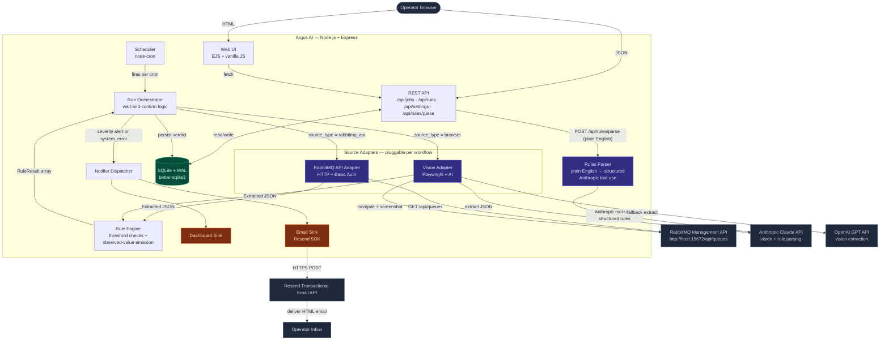
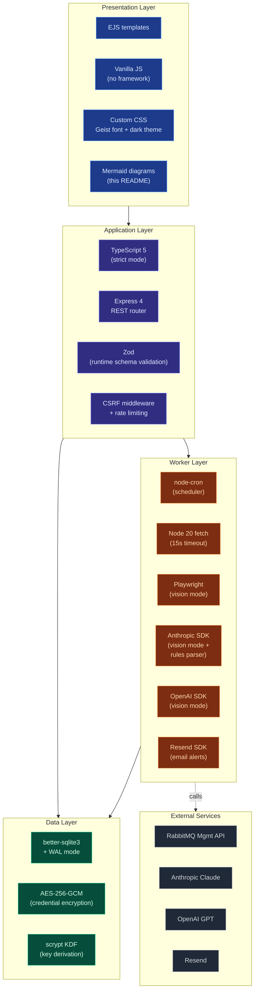
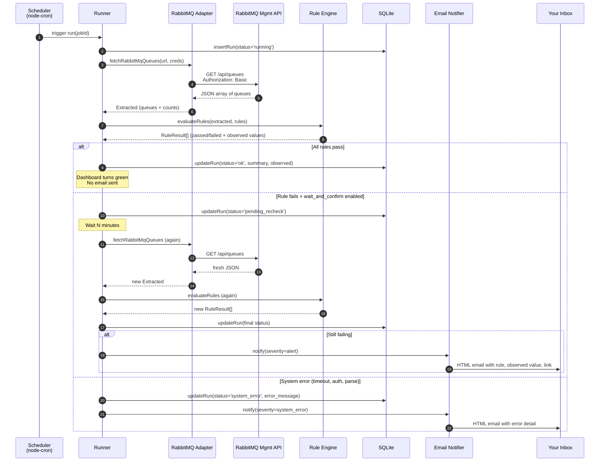

<div align="center">

# Argus AI

**The hundred-eyed watchman for your operations.**

*Always watching. Always confirming.*

[](https://nodejs.org)
[](https://www.typescriptlang.org)
[](https://expressjs.com)
[](https://sqlite.org)
[](https://resend.com)
[]()

</div>

---

> 🔀 **Want to rename this platform?** The brand is centralized in one file: [`src/branding.ts`](src/branding.ts). Edit the four lines there and the entire UI (sidebar, page titles, browser tab), startup banner, and email templates all rebrand automatically. See [How to rename this platform](#how-to-rename-this-platform) below.

## Table of Contents

1. [What is Argus AI?](#what-is-argus-ai)
2. [The problem we solve](#the-problem-we-solve)
3. [How it works in plain English](#how-it-works-in-plain-english)
4. [System architecture (diagram)](#system-architecture)
5. [Technology stack (diagram)](#technology-stack)
6. [What happens during one run, step by step](#what-happens-during-one-run-step-by-step)
7. [The dashboard — your single pane of glass](#the-dashboard--your-single-pane-of-glass)
8. [Health rules and thresholds](#health-rules-and-thresholds)
9. [Plain-English rule writing (powered by Claude)](#plain-english-rule-writing-powered-by-claude)
10. [Self-confirmation — proving the system is alive](#self-confirmation--proving-the-system-is-alive)
11. [Email alerts (Resend)](#email-alerts-resend)
12. [Quick start](#quick-start)
13. [Configuration reference (.env)](#configuration-reference-env)
14. [Two operating modes: API-direct vs Vision](#two-operating-modes-api-direct-vs-vision)
15. [Security model](#security-model)
16. [Project structure](#project-structure)
17. [How to rename this platform](#how-to-rename-this-platform)
18. [Roadmap](#roadmap)
19. [Acknowledgments](#acknowledgments)

---

## What is Argus AI?

**Argus AI is a monitoring platform that watches your business-critical message queues and tells you — *with evidence* — whether they are healthy.**

Named after [Argus Panoptes](https://en.wikipedia.org/wiki/Argus_Panoptes), the giant in Greek mythology with a hundred eyes who never slept, Argus AI is designed for one job: **never miss a problem in your operational pipelines, and never let you assume "everything is fine" when it isn't.**

In simple terms:

- Argus connects to your queue system (currently **RabbitMQ**, via its built-in HTTP management interface — the same one you log into in a browser).
- It reads the live state of your queues on a schedule you set (a *cron schedule* — think "every hour during business days").
- It checks that state against the rules you defined (e.g. *"every primary queue must have at least one consumer worker active"*, *"no dead-letter queue may hold more than 10 messages"*).
- If everything passes, you get **green visual confirmation** on a beautiful dashboard.
- If anything fails — or if the entire monitoring system itself stops firing — Argus sends you an **HTML alert email** with the exact reason, the measured numbers, and a direct link to drill in.

It's the difference between **"I think things are running"** and **"I can see, right now, that the last 12 health checks across the last 12 hours all passed, and the actual measured values for every rule were inside the safe range."**

---

## The problem we solve

Most monitoring tools alert you when something is *already broken*. That's necessary but not sufficient — because **silence is not the same as success**. If your monitor itself dies (a process crashes, a credential expires, a network rule changes), you stop getting alerts. You assume everything is fine. Then a real incident hits and you only find out from your customers.

Argus solves this with three guarantees:

1. **Visible positive confirmation.** The dashboard shows a strip of the last 20 runs as colored dots. Five green dots in a row is *proof* the schedule is firing AND producing healthy verdicts — not just absence of alerts.
2. **Observed-value pills.** Next to every rule, the dashboard shows the *actual measured number* on the most recent run (e.g. `observed 1–3 ✓` next to a threshold of `≥ 1`). You don't just see "healthy" — you see the real numbers.
3. **Stale-run detection.** If the scheduler should have run by now but hasn't, the workflow card turns yellow with a clear warning — *"No run since scheduled time (Xh overdue). Scheduler may have stopped — investigate before trusting the healthy badge."*

The combination of these three means **the absence of an email is itself meaningful**: the dashboard is showing green dots, the observed numbers are in range, and the next-run timer is on schedule. You have *positive* evidence of health, not just *absence* of failure.

---

## How it works in plain English

Think of Argus as an employee who, every hour during business hours:

1. **Logs into your RabbitMQ admin interface** (using credentials you provided — encrypted on disk).
2. **Reads the live state of every queue** that matches a name filter you set (e.g. "all queues containing the word `blueyonder`").
3. **Compares the readings to your rules** ("at least 1 consumer", "no more than 50 backed-up messages", "DLQs under 10 messages").
4. **If a rule fails** and you've enabled the *wait-and-confirm* safety net, Argus waits a configurable number of minutes and checks again — to avoid alerting on a transient blip.
5. **Records the result** to a local database (every run is auditable forever — screenshots if vision mode, JSON data if API mode).
6. **Sends an email** when something is genuinely wrong, with a clear subject line, the failing rule, the observed value, and a clickable link to the run detail page.
7. **Updates the dashboard** so you can verify health at a glance from any browser.

The "AI" in Argus AI refers to **three** distinct capabilities:

- A **plain-English rule writer** (Claude via tool-use). Type *"every primary queue should have at least 1 consumer and DLQs shouldn't exceed 10 ready messages"* into the Job Builder and Argus converts it to structured rules ready to save. See [Plain-English rule writing](#plain-english-rule-writing-powered-by-claude) below.
- A **vision-AI fallback mode** (using Anthropic Claude or OpenAI GPT) that can read screenshots of any web admin UI, not just RabbitMQ. This is the "anything-monitorable" capability, useful when no API exists. See [README-VISION.md](./README-VISION.md) for details.
- An **intelligent rule engine** that emits structured observed values and supports wait-and-confirm logic, going beyond simple "alert on threshold" tools.

For RabbitMQ specifically, **the scheduled monitoring path uses zero AI calls** — it talks to RabbitMQ's HTTP Management API directly, parses JSON, runs rules. AI is invoked only in two situations: (1) when an operator is *writing* rules in plain English in the Job Builder (interactive, one-off), or (2) when a workflow is explicitly configured for Vision mode (`source_type: 'browser'`, used for systems with no API). The blueYonder workflow that ships seeded uses the direct API path — so your queues are checked many times per day with no per-check AI cost.

---

## System architecture

<div align="center">
  
  <br />
  <sub><i>Full-resolution architecture diagram. Source: <a href="docs/architecture.d2">docs/architecture.d2</a> · Rendered with <a href="https://d2lang.com">D2</a> (ELK layout, dark-mauve theme).</i></sub>
</div>

<br />

The Mermaid version below renders inline on GitHub (no image needed) and is kept in sync with the SVG. It shows how a single scheduled run flows through Argus end-to-end.



**Key ideas in the diagram:**

- The **same rule engine and dashboard** work for both source adapters. The **API adapter** is fast and free (no AI cost at runtime). The **vision adapter** is slower but can monitor *anything that has a web UI*, even if it has no API. You pick per workflow.
- The **Rules Parser** is a separate code path from the runtime. It's only called when the operator types plain English into the Job Builder and clicks *"Convert to rules"* — never during a scheduled run. So adding the AI-rule-writing feature adds **zero ongoing cost** to your monitoring; the model is invoked only when a human is actively writing rules.

---

## Technology stack



**Why these choices in business terms:**

| Layer | Choice | Why |
|---|---|---|
| Runtime | **Node.js 20** | Mature ecosystem, native `fetch()`, fast enough for sub-second response times. |
| Language | **TypeScript** | Compile-time safety; mistakes are caught before they reach production. |
| Database | **SQLite (WAL mode)** | Zero-config; no separate database server to operate. Auditable forever. |
| Encryption | **AES-256-GCM** | Industry-standard for storing credentials at rest. The same algorithm banks use. |
| Email | **Resend** | Modern transactional email service; free tier covers 100 emails/day. One API key, no SMTP gymnastics. |
| UI | **Server-rendered EJS + vanilla JS** | No build pipeline, no React rebuild on every deploy. Fast to ship. Easy for any web developer to extend. |
| Background runs | **node-cron** | Same syntax as Unix cron — familiar to operators. |
| Schema validation | **Zod** | Validates every incoming API payload at the boundary; bad input never reaches business logic. |

---

## What happens during one run, step by step

Imagine your cron schedule says "every hour, weekdays, 9 AM to 6 PM." Here is exactly what Argus does the moment that minute hand strikes:



The numbered arrows are the wire-level (network protocol) interactions. Each is timed, error-handled, and recorded.

---

## The dashboard — your single pane of glass

Open `http://localhost:8000` in any browser. You'll see one card per workflow. Every card answers four questions at a glance:

1. **Is it healthy right now?** The status badge (top-right of each card) shows `healthy`, `alert`, `system error`, `rechecking`, or `never run`, with semantic color (green/red/yellow).
2. **Has it BEEN healthy recently?** The *recent-runs strip* shows the last 20 runs as colored squares (green = ok, red = alert, yellow = system error). Mouse-hover any square to see that run's timestamp and summary; click to open its detail page.
3. **What are the actual measured numbers?** Next to each rule's threshold (e.g. `≥ 1`, `≤ 50`), an `observed N ✓` pill shows the actual value measured on the most recent run. You see `observed 1–3 ✓` next to `≥ 1` — meaning the consumer counts measured were between 1 and 3, comfortably above the threshold.
4. **Is the schedule still firing?** The card shows "Last run" (relative) and "Next run" (absolute). If the next run was in the past and no new run has happened within a 5-minute grace window, a yellow stale-run banner appears: *"No run since scheduled time (Xh overdue). Scheduler may have stopped."*

Click into any run to see its full detail: per-rule pass/fail, the extracted queue data table (with primary/DLQ pill badges), and — for vision-mode runs — the captured screenshots side by side.

---

## Health rules and thresholds

A rule has six parts:

| Part | Example | What it means |
|---|---|---|
| **Description** | `"Primary queues must have ≥ 1 consumer"` | Human-readable label, shown on dashboard and in alert emails. |
| **Target** | `primary` / `dlq` / `all` | Which subset of queues this rule applies to. (DLQ = queue name ends in `.dlq`.) |
| **Metric** | `consumer_count` / `ready_messages` / `unacked_messages` / `row_count` | Which number to look at. |
| **Operator** | `>=`, `>`, `==`, `<=`, `<`, `!=` | How to compare. |
| **Threshold** | `1` / `50` / `10` | The number to compare against. |
| **Wait & confirm** | `true` / `false` + `wait_minutes` | If true, a single failure does not immediately alert. Argus waits N minutes and re-checks. Only a *second* failure produces an alert. Crucial for noisy metrics. |

The seeded blueYonder workflow ships with four rules out of the box (see [seed.ts](src/seed.ts)), and you can add, edit, or remove rules from the **Job Builder** page (`/builder/{id}`).

---

## Plain-English rule writing (powered by Claude)

The structured rule form above is reliable but stiff. Most operators don't *think* about queues in terms of "target, metric, operator, threshold, wait-and-confirm" — they think in sentences. **"Every primary queue should have at least one consumer. If any DLQ goes above 10 ready messages, alert me, but wait 5 minutes to confirm. We should always have exactly 6 queues in total."**

Argus accepts that paragraph directly. Paste it into the Job Builder's new **"Describe your rules in plain English"** box, click **✨ Convert to rules**, and three structured rules drop into the form below — already filled out, ready to be reviewed, tweaked, and saved.

### How it works (under the hood)


1. The browser POSTs the text to `POST /api/rules/parse` on the Argus server.
2. The server forwards the text to **Anthropic's Claude API** ([anthropic.com](https://www.anthropic.com/claude)) with a strict **tool-use definition** (a JSON-Schema-based contract that tells the model exactly which fields are allowed and what enum values each field can take — `target` ∈ `{primary, dlq, all}`, `metric` ∈ `{consumer_count, ready_messages, unacked_messages, row_count}`, and so on).
3. The model is forced to call the `add_rule` tool — once per distinct rule it identifies in the text. **This is what guarantees structured output**: the model literally cannot emit free-form text instead of a rule.
4. The server then **re-validates** every tool call against the Zod schema before accepting it, so even a hallucinated enum value or an out-of-range threshold gets filtered out and reported in the `notes` field of the response.
5. The browser receives `{ rules: [...], notes: [...] }` and calls the same `addRule()` function the manual form uses — meaning the AI-generated rules are *visually indistinguishable* from manual ones, and the operator can edit any of them before saving.

### Example: input → output

> **Input (paste this into the box):**
> *"Every primary queue must have at least one consumer. If any DLQ goes above 10 ready messages, alert me — but wait 5 minutes to confirm. We should always have exactly 6 queues in total."*

| Description (from model) | target | metric | op | threshold | wait_and_confirm | wait_minutes |
|---|---|---|---|---|---|---|
| Every primary queue must have at least one consumer | `primary` | `consumer_count` | `>=` | `1` | `false` | `5` |
| DLQs must not exceed 10 ready messages (with 5-min recheck) | `dlq` | `ready_messages` | `<=` | `10` | `true` | `5` |
| Filter must show exactly 6 queues | `all` | `row_count` | `==` | `6` | `false` | `5` |

### Why this matters for non-technical stakeholders

| Before (manual form only) | After (plain-English option) |
|---|---|
| Operator must mentally map "no consumers" → `consumer_count` + `>=` + `1`. | Operator writes "needs a consumer" — the model handles the mapping. |
| Easy to misclick the operator dropdown (`>=` vs `<=`). | Model picks the operator from the user's *language* — "no more than" → `<=`. |
| New team members need a guided walk-through to write their first rule. | New team members write rules the way they'd describe them in Slack. |
| Bulk-creating rules means clicking "Add another rule" N times. | Bulk-creating rules means writing a paragraph. |

### Setup

The feature is optional and **degrades gracefully**: if no API key is configured, the builder still works (you just won't see the AI shortcut take effect — the endpoint returns a clean `503` with a helpful hint message).

To enable it:

1. Get an Anthropic API key from [console.anthropic.com](https://console.anthropic.com/) (the same place you'd get a key for Vision mode — they share the key).
2. Add it to your `.env`:
   ```ini
   ANTHROPIC_API_KEY=sk-ant-xxxxxxxxxxxxxx
   # Optional override — default model is Claude Haiku for cost efficiency.
   # You can switch to Sonnet for harder phrasing or Opus for maximum reliability.
   RULES_PARSER_MODEL=claude-haiku-4-5-20251001
   ```
3. Restart Argus. The button is now live.

### Limits, cost, and safety

- **Cost:** Claude Haiku is roughly **$1 per million input tokens / $5 per million output tokens** at the time of writing. A typical rule-parsing call is ~300 input tokens and ~500 output tokens — under one cent per conversion. You can convert thousands of rule descriptions for a few dollars.
- **Rate limit:** the `/api/rules/parse` endpoint is capped at **5 requests per minute** (same bucket as manual run triggers) to prevent runaway costs from a stuck UI loop.
- **Input limit:** maximum **5,000 characters** per request. Longer text → reject with a clean `400`.
- **Output limit:** maximum **12 rules** per request. If the model emits more, the first 12 are kept and the rest are summarized in the `notes` field.
- **Validation:** every tool call is re-validated against the Zod schema (the same schema used by the manual form). Malformed rules are silently dropped and reported in `notes` so the operator can investigate.
- **No data retention:** the prompt and response are not stored anywhere on the Argus server. They live only in the HTTP request/response and Anthropic's transient logs (per Anthropic's [data policy](https://www.anthropic.com/legal/privacy)).

### What the model *will not* do

- It will not invent metrics that don't exist in the schema. The enum is hard-constrained by the tool definition.
- It will not save anything — the structured rules appear in the form, but the operator clicks **Save workflow** to commit.
- It will not affect any *existing* rules in the form. The newly-parsed rules are *added* to the list; the operator can delete them with the trash-can icon if they're wrong.

---

## Self-confirmation — proving the system is alive

This is the part most monitoring tools skip. Argus answers the question **"how do I know it's still working?"** in three independent ways:

### 1. Recent-runs strip

Every workflow card has a row of small colored squares — the last 20 runs in chronological order. The counter next to it shows `N/M healthy` (e.g. `19/20 healthy`). Five green squares in a row is a direct visual proof that:

- The scheduler is firing on time.
- The credentials still work.
- The network path is open.
- The rule engine is producing decisions.
- The database is recording them.

Compare to a single "healthy" badge, which can mean "the last run was OK" — but the last run might have been three days ago.

### 2. Observed-value pills

Each rule line shows `observed X ✓` (green) or `observed X ✗` (red) next to the threshold. The pill displays the actual measured number on the most recent run:

- `row_count` rules show a single value.
- Per-queue rules show a min–max range across the targeted queues (e.g. `observed 0–47 ✗` next to `≤ 10` clearly shows which queue is causing the trouble).

This means you don't just see *"healthy"* — you see the **real numbers behind the verdict**. Reviewers can sanity-check the system without trusting a green badge.

### 3. Stale-run detection

If the time is past the scheduled next-run-at, plus a 5-minute grace window, and no run has happened, the card shows a prominent yellow banner: *"No run since scheduled time (Xh overdue). Scheduler may have stopped — investigate before trusting the healthy badge."*

This catches the worst failure mode: **the monitor itself has died but the dashboard still shows the last (stale) verdict as healthy**.

---

## Email alerts (Resend)

When a run produces an `alert` (a rule failed for real, including after wait-and-confirm) or a `system_error` (timeout, auth failure, malformed response), Argus sends an HTML email immediately.

The email contains:

- **Subject line**: `[Argus AI] 🔴 ALERT · Workflow Name — 1 of 4 rule(s) failed: dlq: violation on ready_messages ≤ 10 (orders.dlq=47)`
- **Body**: a clean HTML card with a severity badge, the workflow name, the summary, a bulleted list of failing rules with their messages, the full error trace if it was a system error, and a one-click link to the run detail page on Argus.

### Setup (one-time)

1. Create a free account at [resend.com](https://resend.com) (no credit card needed; 100 emails/day on the free tier).
2. Generate an API key from the Resend dashboard.
3. Edit your `.env`:

```ini
RESEND_API_KEY=re_yourkeyhere
NOTIFY_EMAIL_TO=you@yourcompany.com
NOTIFY_EMAIL_FROM_NAME=Argus AI
# Default from address uses Resend's onboarding sender (works for testing).
# For production, verify your own domain in Resend and change this:
NOTIFY_EMAIL_FROM=alerts@yourdomain.com
PUBLIC_BASE_URL=http://your-argus-host:8000
```

4. Restart Argus. The Settings page (`/settings`) will now show a green **"configured"** badge under the Email Alerts section, and a **"Send test email"** button to verify the integration end-to-end.

### Behavior when not configured

Argus runs **just fine** without email configured — runs still complete, results still record to the dashboard. The Settings page shows the email section as **"not configured"** with a hint on how to enable it. No part of the system will block or break because email is missing.

---

## Quick start

```bash
git clone https://github.com/veerayk1/ops-monitor-node.git argus-ai
cd argus-ai
npm install
cp .env.example .env

# Optional: edit .env to add Resend keys for email alerts.
# RabbitMQ-API mode does not need any AI keys.

npm run build
npm start
```

Open **http://localhost:8000**.

The first time it starts, Argus:

- Creates the SQLite database at `data/ops_monitor.db`.
- Auto-generates an `ENCRYPTION_KEY` in your `.env` (used to encrypt stored RabbitMQ passwords at rest).
- Seeds a sample workflow (`RabbitMQ — blueYonder Queues`) pointed at `http://canldsaav01d:15672` with a blank password.

**To use the seeded workflow:** click **Edit** on the card → enter your RabbitMQ password → **Save** → **Run now**.

---

## Configuration reference (`.env`)

| Variable | Default | Purpose |
|---|---|---|
| `HOST` | `127.0.0.1` | Network interface to bind. Use `0.0.0.0` to expose externally (behind a reverse proxy ideally). |
| `PORT` | `8000` | HTTP port. |
| `SCHEDULER_TZ` | system | IANA timezone for cron (e.g. `America/Toronto`). Leave blank for system default. |
| `ENCRYPTION_KEY` | auto-gen | AES-256-GCM key for credential encryption. **Do not lose this file** — losing it makes stored RabbitMQ passwords unrecoverable. |
| `ENCRYPTION_SALT` | auto-gen | scrypt KDF salt. Generated alongside the key. |
| `RESEND_API_KEY` | *(blank)* | Resend API key. Leave blank to disable email alerts. |
| `NOTIFY_EMAIL_FROM` | `onboarding@resend.dev` | Sender address. For production use a verified domain. |
| `NOTIFY_EMAIL_FROM_NAME` | `Argus AI` | Friendly name shown in the recipient's inbox. |
| `NOTIFY_EMAIL_TO` | *(blank)* | Recipient address(es). |
| `PUBLIC_BASE_URL` | *(blank)* | Public URL of this Argus instance — used to make run-detail links clickable in emails. |
| `ANTHROPIC_API_KEY` | *(blank)* | Used for **Vision mode** *and* for the **plain-English rules parser** in the Job Builder. RabbitMQ-API runtime mode does not require this. |
| `ANTHROPIC_MODEL` | `claude-opus-4-5` | Model used by Vision mode. The rules parser uses its own model (see below). |
| `RULES_PARSER_MODEL` | `claude-haiku-4-5-20251001` | Model used by the plain-English rules parser. Haiku is cheap and accurate enough for structured rule extraction; override with Sonnet or Opus for harder phrasing. |
| `OPENAI_API_KEY` | *(blank)* | Only needed for **Vision mode** as a fallback. |
| `BROWSER_MODE` | `headed` | `headed` shows the browser during vision runs; `headless` is invisible. |
| `BROWSER_CHANNEL` | `msedge` | `msedge` for Edge, `chromium` for default Chromium. |

---

## Two operating modes: API-direct vs Vision

Argus supports two ways to extract data from a monitoring target. **Each workflow chooses one mode** via its `source_type` field.

### Mode 1 — RabbitMQ API direct (`source_type: 'rabbitmq_api'`) — **the default**

- **What it does:** HTTP GET against `/api/queues` on the RabbitMQ management plugin, with HTTP Basic Auth.
- **Speed:** ~10–100 ms per check.
- **Cost:** Free. No AI calls.
- **Reliability:** Depends only on the HTTP API itself; no brittle browser selectors.
- **Limits:** Only works against systems that expose a structured API. For RabbitMQ this is built-in via the `rabbitmq_management` plugin.

### Mode 2 — Vision (browser + AI) (`source_type: 'browser'`)

- **What it does:** launches a real browser (Microsoft Edge or Chromium via Playwright), logs in, navigates, takes a screenshot, sends it to Claude or GPT, parses the structured JSON the model returns.
- **Speed:** ~10–30 seconds per check.
- **Cost:** A fraction of a cent per call (the screenshot is small).
- **Reliability:** Works against *any* web UI, even systems with no API. AI is robust to minor UI changes.
- **Use case:** legacy admin panels, third-party SaaS dashboards without APIs, anything that only has a human-facing UI.

📖 **For full details on Vision mode** — how it works, when to use it, configuration, cost considerations — see **[README-VISION.md](./README-VISION.md)**.

---

## Security model

Argus is designed to be self-hosted on a trusted network. The security primitives included:

| Concern | How Argus handles it |
|---|---|
| **Stored credentials** | RabbitMQ usernames/passwords are encrypted in SQLite using AES-256-GCM. The encryption key lives only in `.env` (which is `.gitignore`d). |
| **API keys** | Never displayed in the UI. The Settings page shows only a redacted hint (`sk-ant-…xxxx`). |
| **CSRF protection** | All mutating endpoints require the `x-csrf-token` header. Tokens are 24-byte random, single-use-pool, 24h TTL. |
| **Rate limiting** | 60 requests/minute on `/api/*`, 5/minute on manual run triggers and provider test endpoints. |
| **HTTP headers** | `X-Content-Type-Options: nosniff`, `X-Frame-Options: DENY`, `Referrer-Policy: strict-origin-when-cross-origin`. |
| **XSS** | All user-sourced values pass through HTML entity encoding (`esc()`) before insertion. |
| **No multi-user auth (v0.2)** | This is a single-operator POC. Bind to `127.0.0.1` and put behind an SSO proxy if you expose externally. Multi-user auth is on the roadmap. |

---

## Project structure

```
argus-ai/
├── src/
│   ├── server.ts              # Express entry, CSRF, rate limits, mounts routers
│   ├── branding.ts            # ⭐ Single source of truth for brand (name/tagline/version)
│   ├── config.ts              # Env loading + validation
│   ├── crypto.ts              # AES-256-GCM credential encryption
│   ├── database.ts            # SQLite schema, migrations, CRUD
│   ├── types.ts               # TypeScript + Zod schemas
│   ├── notifications.ts       # Notifier dispatcher
│   ├── notifications/
│   │   └── email.ts           # Resend-based EmailNotifier
│   ├── scheduler.ts           # node-cron + overlap protection
│   ├── seed.ts                # First-run sample workflow
│   ├── api/                   # Express routers
│   │   ├── jobs.ts            # /api/jobs CRUD + manual run
│   │   ├── runs.ts            # /api/runs history + detail
│   │   ├── settings.ts        # /api/settings + provider test + email test
│   │   ├── rules-parse.ts     # ⭐ /api/rules/parse — plain-English → structured rules
│   │   └── pages.ts           # HTML page routes
│   └── worker/
│       ├── runner.ts          # Orchestrates one run + wait-and-confirm
│       ├── rabbitmq.ts        # RabbitMQ Management API adapter
│       ├── browser.ts         # Playwright adapter (vision mode)
│       ├── evaluator.ts       # AI provider dispatcher with fallback
│       ├── rules.ts           # Rule engine + observed-value emission
│       └── providers/         # Anthropic / OpenAI vision implementations
├── views/                     # Server-rendered EJS templates
│   ├── partials/
│   ├── dashboard.ejs
│   ├── builder.ejs
│   ├── settings.ejs
│   └── run_detail.ejs
├── public/
│   ├── css/styles.css
│   ├── js/{dashboard,builder,settings,run_detail}.js
│   └── screenshots/           # Captured screenshots, kept for audit
├── data/ops_monitor.db        # SQLite (created on first run, gitignored)
├── .env / .env.example
├── package.json
├── tsconfig.json
├── README.md                  # ← you are here
└── README-VISION.md           # Vision/browser mode reference
```

---

## How to rename this platform

The current name **"Argus AI"** is a working name. Renaming is a one-file change.

### Step 1 — Edit `src/branding.ts`

Open [`src/branding.ts`](src/branding.ts) and change the four constants:

```typescript
export const BRAND = {
  name: 'Argus AI',                                       // ← change this
  tagline: 'the hundred-eyed watchman',                   // ← and this
  longTagline: 'the hundred-eyed watchman for your operations',  // ← and this
  version: 'v0.2',                                        // ← and this if version bumped
} as const;
```

**Everywhere that reads from this object updates automatically:**

| Where it shows up | How it pulls from `BRAND` |
|---|---|
| Sidebar brand block | `views/partials/header.ejs` → `<%= brand.name %>` |
| Sidebar tagline | `views/partials/header.ejs` → `<%= brand.version %> · <%= brand.tagline %>` |
| Browser tab title (every page) | `views/partials/header.ejs` → appends `" — " + brand.name` to each page's section title |
| Server startup log | `src/server.ts` → `${BRAND.name} running at…` |
| Email subject prefix | `src/notifications/email.ts` → `[${BRAND.name}] 🔴 ALERT · …` |
| Email body run-detail link | `src/notifications/email.ts` → `View run #N on ${BRAND.name} →` |
| Email footer | `src/notifications/email.ts` → `Sent by ${BRAND.name} · ${BRAND.longTagline}` |
| Test-email subject + body | `src/api/settings.ts` |

### Step 2 — Update the three files that don't import branding

Some files are plain text/JSON without a JavaScript import — these need a separate manual update:

| File | What to change | Why it's separate |
|---|---|---|
| `package.json` | `"name"` (npm slug — lowercase, hyphenated) and `"description"` | Plain JSON, no imports |
| `README.md` | Hero block, headings, the Argus mythology section, all mentions | Documentation, not code |
| `README-VISION.md` | Headings and mentions | Documentation, not code |

### Step 3 — Rebuild and restart

```bash
npm run build
npm start
```

That's it. Refresh the browser and the new name is everywhere.

### What does NOT need to change

- Database filename (`data/ops_monitor.db`) — keeping it stable means existing data on operator machines doesn't get orphaned. The filename is internal-only.
- The `ENCRYPTION_KEY` and `ENCRYPTION_SALT` in `.env` — these are per-instance secrets, unrelated to the brand.
- Internal code identifiers (variable names, table names, etc.) — only the **user-visible strings** are centralized.

---

## Roadmap

| Status | Item |
|---|---|
| ✅ Done | RabbitMQ Management API source adapter |
| ✅ Done | Recent-runs visual strip |
| ✅ Done | Observed-value pills |
| ✅ Done | Stale-run detection |
| ✅ Done | Email alerts via Resend |
| ✅ Done | Wait-and-confirm safety net |
| ✅ Done | Plain-English rule writing (Claude tool-use, hard-constrained schema) |
| 🚧 Next | Slack and Teams notifiers (same `Notifier` interface) |
| 🚧 Next | Daily/weekly summary digests ("here's what ran in the last 24h") |
| 🔮 Future | Multi-user auth + RBAC |
| 🔮 Future | Source adapters for Kafka, RabbitMQ AMQP-direct, AWS SQS, Postgres |
| 🔮 Future | Trend graphs (sparklines of consumer counts over time) |

---

## Acknowledgments

**Argus Panoptes** was the giant in Greek mythology whose hundred eyes never all slept at once. Hera assigned him to watch the heifer Io, and only Hermes, sent by Zeus, was able to lull every eye closed long enough to free her. Argus is the original metaphor for "always-on observation."

When his eyes were finally closed, Hera placed them on the tail of her peacock — which is why peacock feathers have that hundred-eye pattern to this day.

May your queues be ever-watched.

---

<div align="center">
<sub>Argus AI · v0.2 · the hundred-eyed watchman for your operations</sub>
</div>
